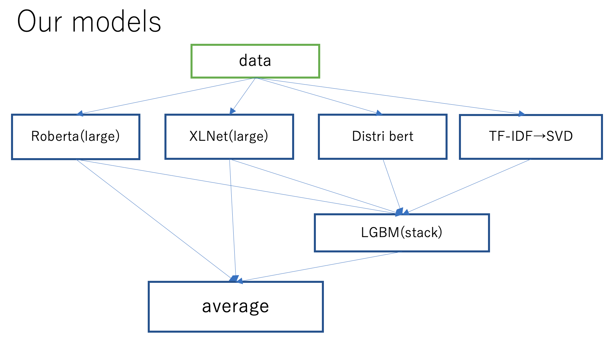

# Google QUEST QA Labeling

This respository contains my code for competition in kaggle.

16th Place Solution for [Google QUEST QA Labeling](https://www.kaggle.com/c/google-quest-challenge "Google QUEST QA Labeling")

Team: [Abhishek Thakur](https://www.kaggle.com/abhishek), [Duy](https://www.kaggle.com/pvduy23), [Yuval Reina](https://www.kaggle.com/yuval6967), [atfujita](https://www.kaggle.com/atsunorifujita)

All models(Team)    
Public LB: 0.47302(7th)   
Private LB: 0.42048(16th)

##### Note: This repository contains only my models and only train script.

My model(5 fold averaging)   
Public LB: 0.40209 
Private LB: 0.38204
##### Note: No post-processing has been applied to this model.

### Model
- XLNet(large)
  - Train:
    - maxlen(body + title) = 512
    - maxlen(answer) = 512
    - batch_size = 4
    - accumulation_steps = 2
    - lr = 1.5e-5

